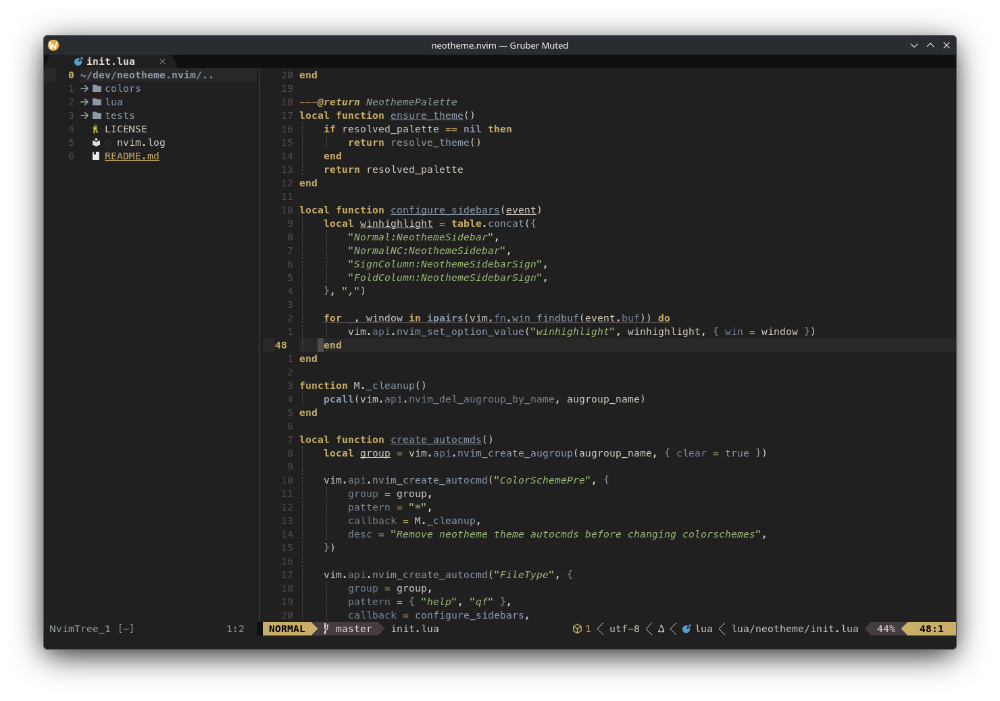

<div align="center">

# neotheme.nvim

A semantic, palette-driven theming engine for Neovim 0.12+, with Gruber Muted and Gruber Darker built in.

[](https://github.com/alsi-lawr/neotheme.nvim/actions/workflows/ci.yml)
[](https://neovim.io/)
[](LICENSE)
<a href="https://dotfyle.com/plugins/alsi-lawr/neotheme.nvim"></a>



<sub>Gruber Muted using the NvimTree, Bufferline, and Lualine integrations.</sub>

</div>

`neotheme.nvim` separates a theme's colors from the places Neovim uses them. Themes define semantic roles such as `surface.base`, `syntax.function_name`, and `diagnostic.error`; the engine resolves those roles into core, Tree-sitter, LSP, terminal, and plugin highlights.

That gives you a coherent colorscheme out of the box, while keeping palette customization and new theme development explicit and predictable.

## Features

- Two complete dark themes: the softer default `gruber-muted` and the higher-contrast `gruber-darker`.
- A validated semantic palette covering surfaces, text, syntax, diagnostics, markup, version control, and UI roles.
- Core Neovim, Tree-sitter, LSP semantic token, terminal, and typography highlights.
- Palette customization without copying or forking a theme.
- A bundled Lualine theme and 15 opt-in plugin integrations.
- A small public API for selecting themes and inspecting the resolved palette.

## Requirements

- Neovim 0.12 or newer.
- A terminal or GUI with true-color support.

## Installation

### lazy.nvim

```lua
{
	"alsi-lawr/neotheme.nvim",
	lazy = false,
	priority = 1000,
	config = function()
		require("neotheme").setup()
		vim.cmd.colorscheme("neotheme")
	end,
}
```

### vim.pack

```lua
vim.pack.add({ "https://github.com/alsi-lawr/neotheme.nvim" })

require("neotheme").setup()
vim.cmd.colorscheme("neotheme")
```

## Themes

Gruber Muted is the default. Select a built-in theme during setup, then load the `neotheme` colorscheme:

```lua
require("neotheme").setup({
	theme = "gruber-darker",
})

vim.cmd.colorscheme("neotheme")
```

| Theme | Character |
| --- | --- |
| `gruber-muted` | Warm, restrained contrast for long sessions. |
| `gruber-darker` | The brighter, higher-contrast Gruber palette. |

`neotheme.nvim` intentionally provides one colorscheme entrypoint. Theme variants are selected with `setup`, not separate `:colorscheme` names.

## Configuration

```lua
require("neotheme").setup({
	theme = "gruber-muted",
	bold = true,
	italic = {
		comments = true,
		strings = true,
		folds = true,
		operators = false,
	},
	underline = true,
	undercurl = true,
	integrations = {
		bufferline = true,
		gitsigns = true,
		nvim_tree = true,
		telescope = true,
		trouble = true,
		which_key = true,
	},
})

vim.cmd.colorscheme("neotheme")
```

All integrations are disabled by default. Unknown options and invalid option types fail during setup instead of being silently ignored.

### Palette customization

Use `configure_palette` to change semantic roles before highlights are generated:

```lua
require("neotheme").setup({
	configure_palette = function(palette)
		palette.ui.accent = palette.syntax.keyword
		palette.ui.directory = palette.syntax.function_name
		palette.ui.search = palette.diagnostic.warning
	end,
})
```

The palette is grouped into these categories:

- `surface`
- `text`
- `syntax`
- `diagnostic`
- `markup`
- `version_control`
- `ui`

For a theme built entirely from your own values, select `theme = "custom"`. Custom themes begin with an empty palette, so the configurator must supply every semantic role.

## Integrations

Enable integrations by their setup key:

| Area | Integrations |
| --- | --- |
| Completion | `blink_cmp`, `cmp` |
| Git | `fugitive`, `gitsigns` |
| Navigation and search | `fzf_lua`, `nvim_tree`, `telescope` |
| UI | `bufferline`, `lazy`, `noice`, `snacks`, `trouble`, `which_key` |
| Language and structure | `lspsaga`, `rainbow_delimiters` |

### Lualine

Configure Neotheme before Lualine, then select the bundled theme:

```lua
require("neotheme").setup()
vim.cmd.colorscheme("neotheme")

require("lualine").setup({
	options = {
		theme = "neotheme",
	},
})
```

## API

| Function | Purpose |
| --- | --- |
| `require("neotheme").setup(options)` | Validate configuration and resolve the selected palette. |
| `require("neotheme").palette()` | Return a copy of the resolved semantic palette. |
| `require("neotheme").themes()` | Return the available built-in theme names plus `custom`. |

Mutating the tables returned by `palette()` or `themes()` does not alter Neotheme's internal state.

## Development

Run the formatter check and headless Neovim test suite from the repository root:

```sh
stylua --check .
./tests/run.sh
```

Tests target behavior and semantic palette contracts rather than exact theme color values.

## Acknowledgements

The first `neotheme.nvim` library theme, `gruber-muted`, began from [blazkowolf/gruber-darker.nvim](https://github.com/blazkowolf/gruber-darker.nvim). Thank you to Blazko Wolf and every contributor whose work established its Neovim foundation.

The project also owes its lineage to [rexim/gruber-darker-theme](https://github.com/rexim/gruber-darker-theme), [drsooch/gruber-darker-vim](https://github.com/drsooch/gruber-darker-vim), [Jim Blevins' Emacs port](https://jblevins.org/projects/emacs-color-themes/gruber-darker-theme.el.html), and John Gruber's original [BBEdit Gruber Dark scheme](https://daringfireball.net/projects/bbcolors/schemes/).

## License

MIT. See [LICENSE](LICENSE).
