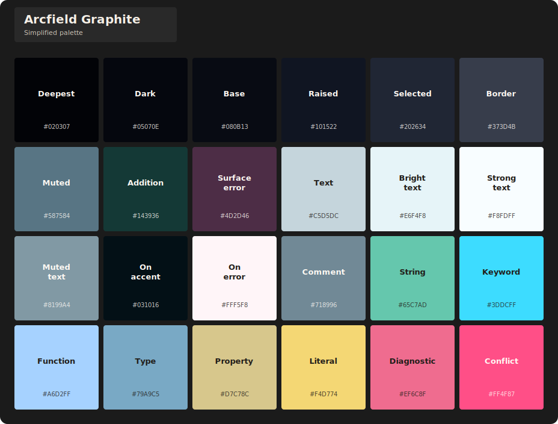
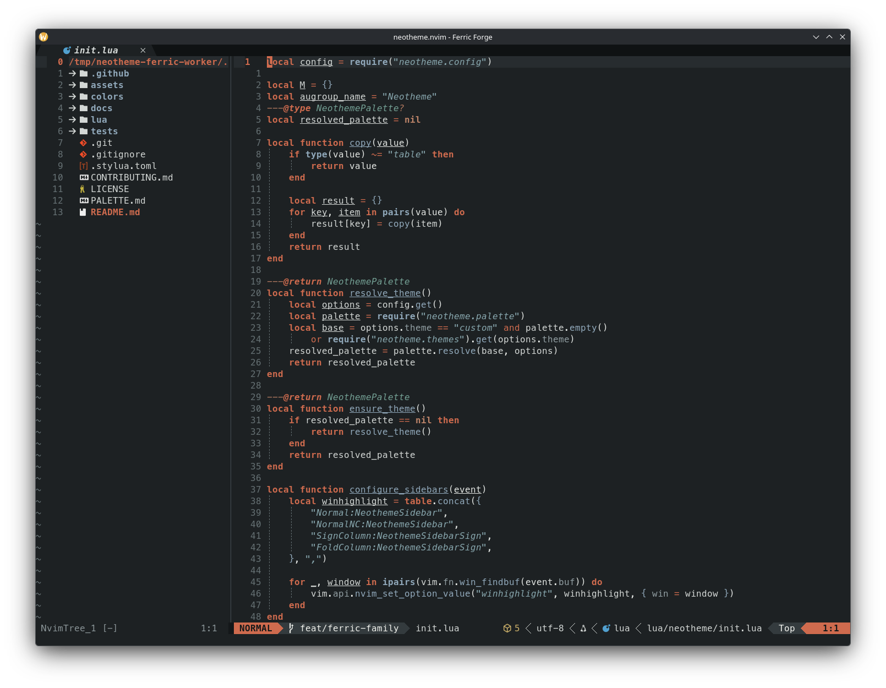
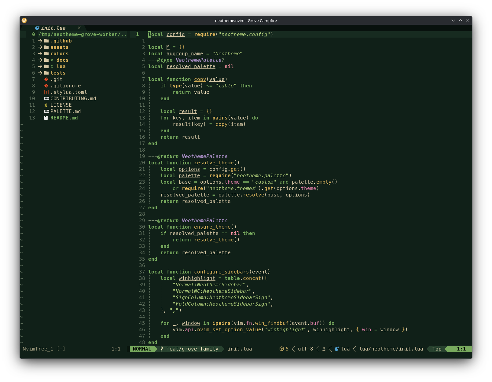
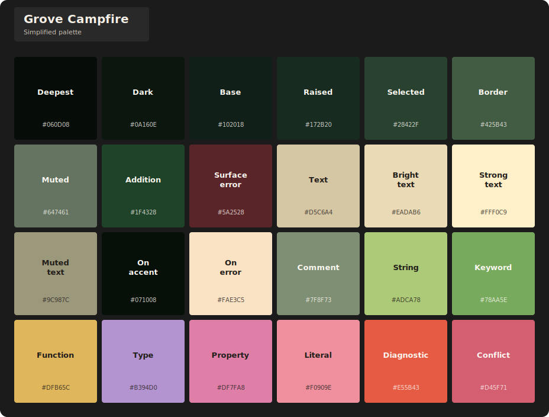
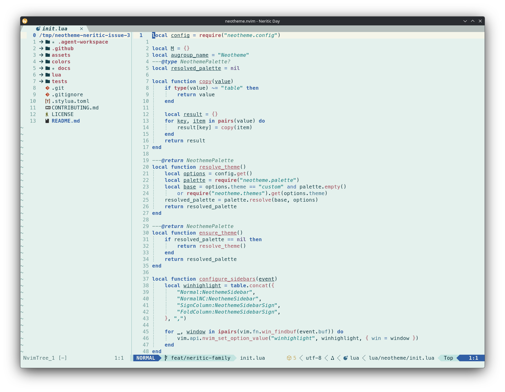
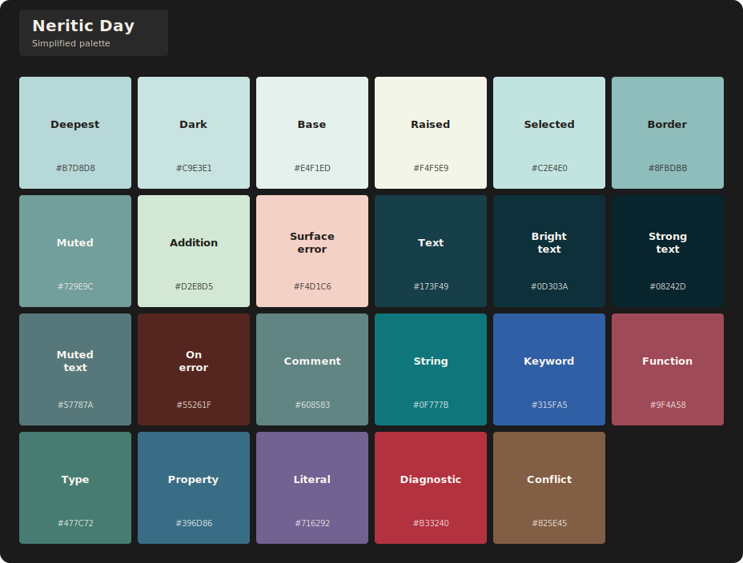
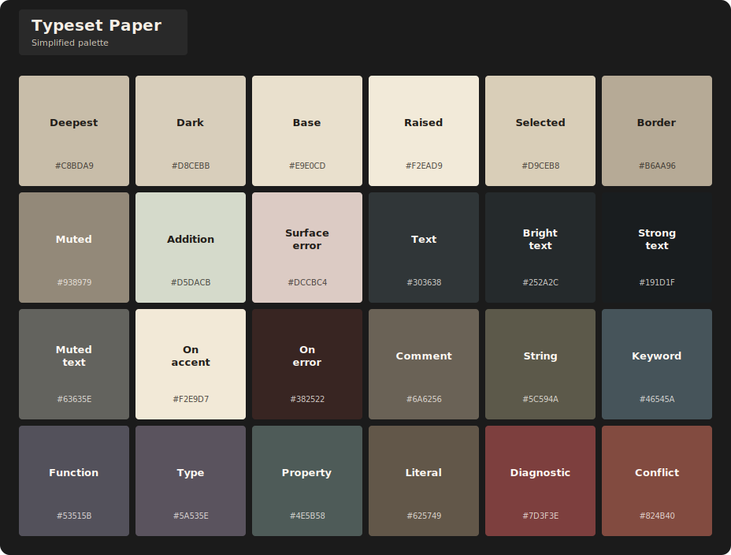
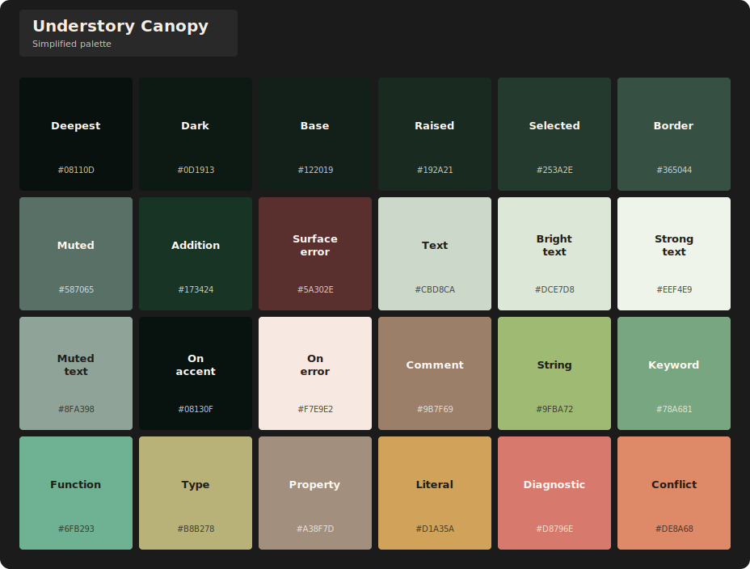

<div align="center">


# neotheme.nvim

A semantic, palette-driven colorscheme for Neovim 0.12+.

[](https://github.com/alsi-lawr/neotheme.nvim/actions/workflows/ci.yml)
[](https://neovim.io/)
[](LICENSE)

</div>

Neotheme separates a theme's colors from the places Neovim uses them. A complete semantic palette drives editor UI, syntax, Tree-sitter, LSP, diagnostics, terminal colors, version control, markup, and opt-in plugin integrations. Themes stay coherent while individual roles remain easy to customize.

Built-in themes are organized into families. Each family keeps its complete inventory and visual examples under `docs/themes/`; Gruber also preserves its lineage attribution. This README highlights one stand-out theme from every family.

## Why Neotheme

- One `:colorscheme neotheme` entrypoint for every built-in and custom theme.
- Semantic palette customization without copying a full colorscheme.
- Core Neovim, Tree-sitter, LSP, terminal, and Lualine support.
- Opt-in highlights for 15 plugins.
- Reproducible editor previews and palette references for every built-in theme.

## Quick start

With [lazy.nvim](https://github.com/folke/lazy.nvim):

```lua
{
	"alsi-lawr/neotheme.nvim",
	lazy = false,
	priority = 1000,
	config = function()
		require("neotheme").setup()
		vim.cmd.colorscheme("neotheme")
	end,
}
```

The default theme is `gruber-dark-muted`. Select another theme during setup and keep the same colorscheme command:

```lua
require("neotheme").setup({
	theme = "gruber-light",
})

vim.cmd.colorscheme("neotheme")
```

See the [Neotheme wiki](https://github.com/alsi-lawr/neotheme.nvim/wiki) for installation alternatives, every option, integrations, palette customization, and the public API.

## Theme families

| Family | Stand-out theme | Range | Full inventory |
| --- | --- | --- | --- |
| Arcfield | `arcfield-graphite` | Two dark and one light variant | [Themes and examples](docs/themes/arcfield/README.md) |
| Bathyal | `bathyal-midwater` | Two dark and one light variant | [Themes and examples](docs/themes/bathyal/README.md) |
| Ferric | `ferric-forge` | One dark and one light variant | [Themes and examples](docs/themes/ferric/README.md) |
| Grove | `grove-campfire` | One dark and one light variant | [Themes and examples](docs/themes/grove/README.md) |
| Gruber | `gruber-dark-muted` | Three dark and three light variants | [Themes, examples, and lineage](docs/themes/gruber/README.md) |
| Neritic | `neritic-day` | Two dark and two light variants | [Themes and examples](docs/themes/neritic/README.md) |
| Typeset | `typeset-paper` | One light and one dark variant | [Themes and examples](docs/themes/typeset/README.md) |
| Typewriter | `typewriter-ink` | Three light and two dark variants | [Themes and examples](docs/themes/typewriter/README.md) |
| Understory | `understory-canopy` | Two dark and two light variants | [Themes and examples](docs/themes/understory/README.md) |

## Family previews

<table>
<tr>
<td align="center" valign="top">
<strong><a href="docs/themes/arcfield/README.md">Arcfield - Graphite</a></strong><br>
<sub>An electrified storm-dark theme with near-black fields, cyan discharge, blue-white callables, and strike-yellow details.</sub><br><br>
<a href="docs/themes/arcfield/arcfield-graphite.png"></a>
<a href="docs/themes/arcfield/arcfield-graphite.svg"></a>
</td>
<td align="center" valign="top">
<strong><a href="docs/themes/bathyal/README.md">Bathyal - Midwater</a></strong><br>
<sub>A near-black pressure-blue theme with cold pale text and sparse deep-ocean signals.</sub><br><br>
<a href="docs/themes/bathyal/bathyal-midwater.png"></a>
<a href="docs/themes/bathyal/bathyal-midwater.svg"></a>
</td>
<td align="center" valign="top">
<strong><a href="docs/themes/ferric/README.md">Ferric - Forge</a></strong><br>
<sub>Charcoal iron and steel with rust, copper, and restrained verdigris.</sub><br><br>
<a href="docs/themes/ferric/ferric-forge.png"></a>
<a href="docs/themes/ferric/ferric-forge.svg"></a>
</td>
<td align="center" valign="top">
<strong><a href="docs/themes/grove/README.md">Grove - Campfire</a></strong><br>
<sub>Leafy forest-dark fantasy with parchment, marigold, moss, foxglove, mallow, peony, and poppy.</sub><br><br>
<a href="docs/themes/grove/grove-campfire.png"></a>
<a href="docs/themes/grove/grove-campfire.svg"></a>
</td>
<td align="center" valign="top">
<strong><a href="docs/themes/gruber/README.md">Gruber - Dark Muted</a></strong><br>
<sub>The warm, restrained default with softened syntax colors and measured contrast.</sub><br><br>
<a href="docs/themes/gruber/gruber-dark-muted.png"></a>
<a href="docs/themes/gruber/gruber-dark-muted.svg"></a>
</td>
<td align="center" valign="top">
<strong><a href="docs/themes/neritic/README.md">Neritic - Day</a></strong><br>
<sub>Turquoise coastal light with deep-ocean text, sea glass, algae, and coral.</sub><br><br>
<a href="docs/themes/neritic/neritic-day.png"></a>
<a href="docs/themes/neritic/neritic-day.svg"></a>
</td>
<td align="center" valign="top">
<strong><a href="docs/themes/typeset/README.md">Typeset - Paper</a></strong><br>
<sub>Warm newsprint carrying ageing blue-black ink, oxidized violet-grey, sepia, and muted residue.</sub><br><br>
<a href="docs/themes/typeset/typeset-paper.png"></a>
<a href="docs/themes/typeset/typeset-paper.svg"></a>
</td>
<td align="center" valign="top">
<strong><a href="docs/themes/typewriter/README.md">Typewriter - Ink</a></strong><br>
<sub>Crisp paper and near-black ink with strong neutral separation.</sub><br><br>
<a href="docs/themes/typewriter/typewriter-ink.png"></a>
<a href="docs/themes/typewriter/typewriter-ink.svg"></a>
</td>
<td align="center" valign="top">
<strong><a href="docs/themes/understory/README.md">Understory - Canopy</a></strong><br>
<sub>Canopy-filtered forest shadow with pine, moss, fern, lichen, bark, and amber.</sub><br><br>
<a href="docs/themes/understory/understory-canopy.png"></a>
<a href="docs/themes/understory/understory-canopy.svg"></a>
</td>
</tr>
</table>

## Customize semantic roles

`configure_palette` receives the selected theme's complete semantic palette before highlights are applied:

```lua
require("neotheme").setup({
	theme = "gruber-dark",
	configure_palette = function(palette)
		palette.ui.accent = palette.syntax.function_name
		palette.diagnostic.warning = palette.syntax.keyword
	end,
	integrations = {
		gitsigns = true,
		nvim_tree = true,
		telescope = true,
	},
})
```

The configurator mutates its argument and returns nothing. Neotheme validates supplied categories, fields, and `#RRGGBB` values.

## Development

Run the formatter and headless Neovim test suite from the repository root:

```sh
stylua --check .
./tests/run.sh
```

Documentation previews are reproducible with the portable tools in [assets/scripts](assets/scripts/README.md):

```sh
./assets/scripts/generate-palette-cards.sh
./assets/scripts/capture-theme-screenshots.sh
```

## License

MIT. See [LICENSE](LICENSE).
