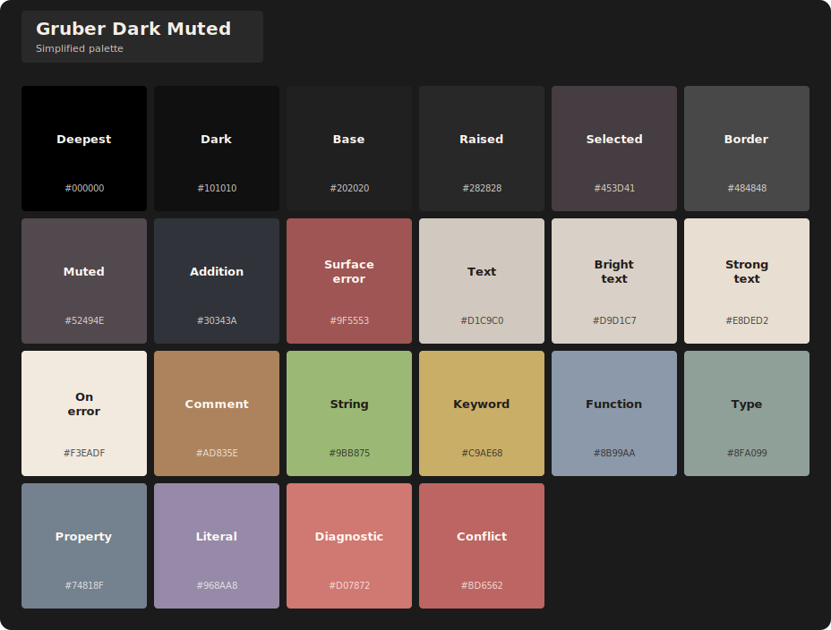
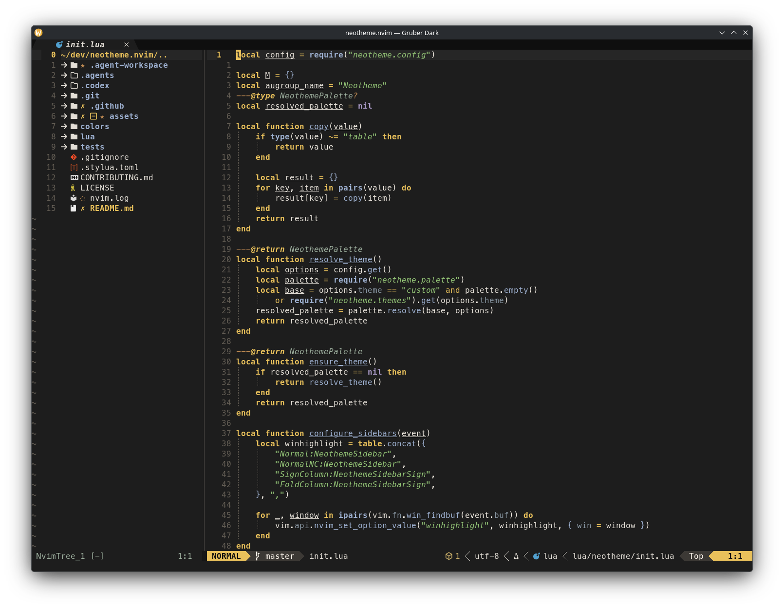
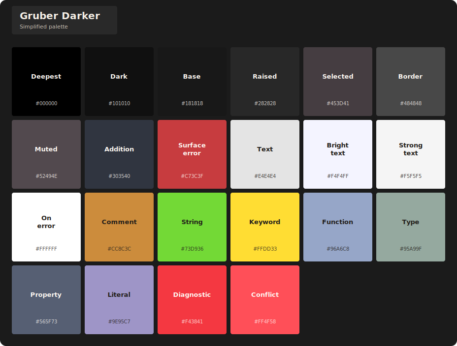
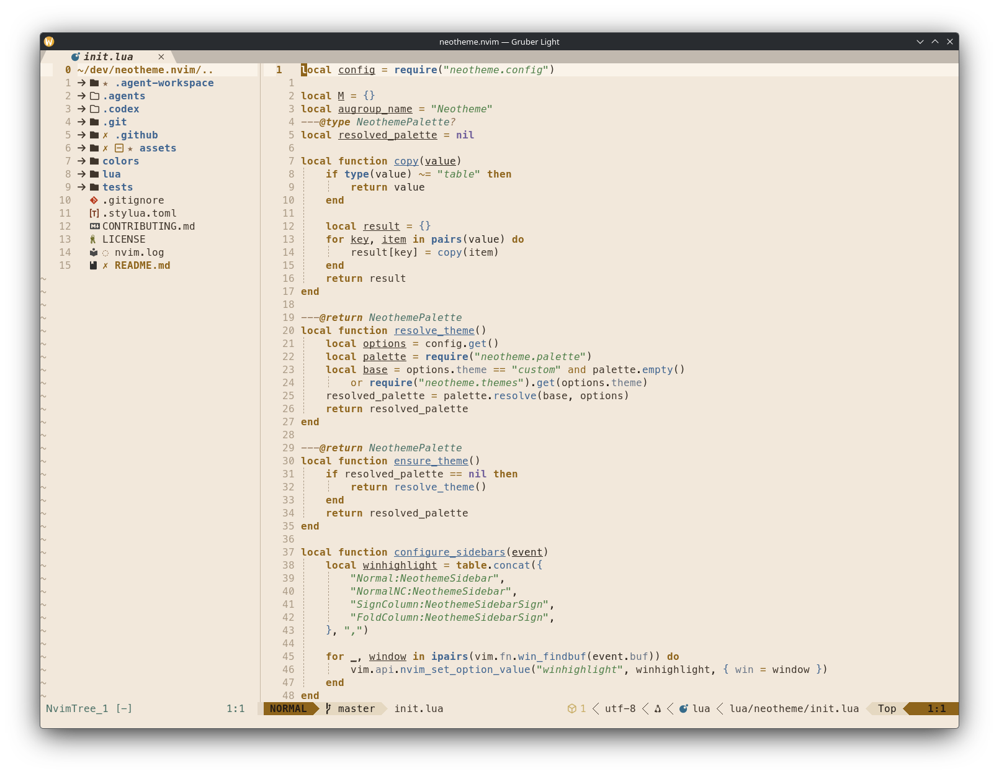
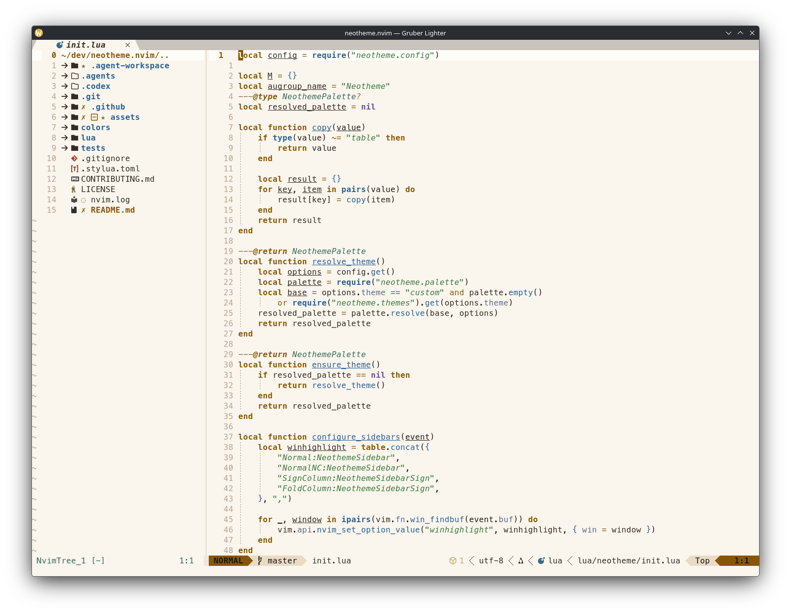

<div align="center">

# neotheme.nvim

A semantic, palette-driven theming engine for Neovim 0.12+, with a curated six-theme Gruber family.

[](https://github.com/alsi-lawr/neotheme.nvim/actions/workflows/ci.yml)
[](https://neovim.io/)
[](LICENSE)
<a href="https://dotfyle.com/plugins/alsi-lawr/neotheme.nvim"></a>

</div>

`neotheme.nvim` separates a theme’s colors from the places Neovim uses them. A semantic palette drives core, Tree-sitter, LSP, terminal, and opt-in plugin highlights, so every variant stays coherent without sacrificing room for deliberate customization.

## Quick start

With [lazy.nvim](https://github.com/folke/lazy.nvim):

```lua
{
	"alsi-lawr/neotheme.nvim",
	lazy = false,
	priority = 1000,
	config = function()
		require("neotheme").setup()
		vim.cmd.colorscheme("neotheme")
	end,
}
```

> [!WARNING]
> **Breaking change:** `gruber-muted` has been renamed to `gruber-dark-muted`. It has no compatibility alias; update your configuration to the new name.

Complete installation, configuration, customization, integration, and API guidance lives in the [Neotheme wiki](https://github.com/alsi-lawr/neotheme.nvim/wiki).

## The Gruber family

`gruber-dark-muted` is the default. Choose another variant during setup, then continue using Neotheme’s single colorscheme entrypoint:

```lua
require("neotheme").setup({
	theme = "gruber-light",
})

vim.cmd.colorscheme("neotheme")
```

| Theme | Character |
| --- | --- |
| `gruber-dark-muted` | Restrained warm dark palette for long sessions. |
| `gruber-dark` | Balanced canonical dark variant. |
| `gruber-darker` | Deep, high-contrast Gruber variant. |
| `gruber-light` | Warm paper-like light variant. |
| `gruber-lighter` | Brighter, clearer light variant. |
| `gruber-light-muted` | Softer, lower-chroma light variant. |

There are no per-theme `:colorscheme` entrypoints: select a theme with `setup`, then load `neotheme`.

## Visual inventory

Each preview uses the same Neovim configuration with NvimTree, Bufferline, and Lualine enabled. Its companion card shows only the simplified palette configured for that theme: one square and a short semantic label per color.

### `gruber-dark-muted` — default

<table>
  <tr>
    <td width="62%" valign="top"></td>
    <td width="38%" valign="top"></td>
  </tr>
</table>

### `gruber-dark`

<table>
  <tr>
    <td width="62%" valign="top"></td>
    <td width="38%" valign="top"></td>
  </tr>
</table>

### `gruber-darker`

<table>
  <tr>
    <td width="62%" valign="top"></td>
    <td width="38%" valign="top"></td>
  </tr>
</table>

### `gruber-light`

<table>
  <tr>
    <td width="62%" valign="top"></td>
    <td width="38%" valign="top"></td>
  </tr>
</table>

### `gruber-lighter`

<table>
  <tr>
    <td width="62%" valign="top"></td>
    <td width="38%" valign="top"></td>
  </tr>
</table>

### `gruber-light-muted`

<table>
  <tr>
    <td width="62%" valign="top"></td>
    <td width="38%" valign="top"></td>
  </tr>
</table>

## Asset tools

The checked-in previews are reproducible with the portable generators in [assets/scripts](assets/scripts/README.md):

```sh
./assets/scripts/generate-palette-cards.sh
./assets/scripts/capture-theme-screenshots.sh
```

The screenshot tool uses your normal Neovim configuration and applies only a temporary selected-theme override. See its [usage and dependencies](assets/scripts/README.md).

## Development

Run the formatter check and headless Neovim test suite from the repository root:

```sh
stylua --check .
./tests/run.sh
```

Tests target behavior and semantic palette contracts rather than exact built-in theme color values.

## Acknowledgements

The first `neotheme.nvim` library theme, now `gruber-dark-muted`, began from [blazkowolf/gruber-darker.nvim](https://github.com/blazkowolf/gruber-darker.nvim). Thank you to Blazko Wolf and every contributor whose work established its Neovim foundation.

The project also owes its lineage to [rexim/gruber-darker-theme](https://github.com/rexim/gruber-darker-theme), [drsooch/gruber-darker-vim](https://github.com/drsooch/gruber-darker-vim), [Jim Blevins’ Emacs port](https://jblevins.org/projects/emacs-color-themes/gruber-darker-theme.el.html), and John Gruber’s original [BBEdit Gruber Dark scheme](https://daringfireball.net/projects/bbcolors/schemes/).

## License

MIT. See [LICENSE](LICENSE).
