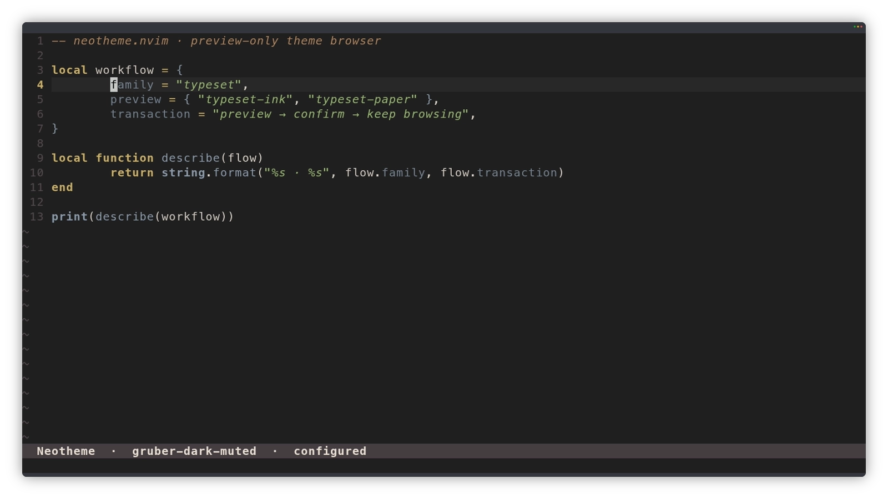
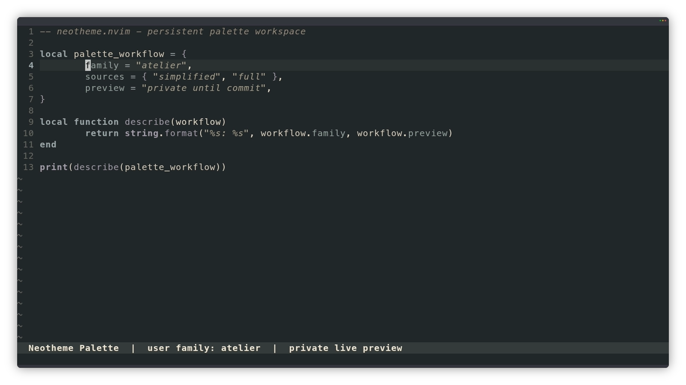

<div align="center">


# neotheme.nvim

A semantic, palette-driven colorscheme for Neovim 0.12+.

[](https://github.com/alsi-lawr/neotheme.nvim/actions/workflows/ci.yml)
[](https://neovim.io/)
[](LICENSE)

</div>

Neotheme separates a theme's colors from the places Neovim uses them. A complete semantic palette drives editor UI, syntax, Tree-sitter, LSP, diagnostics, terminal colors, version control, markup, and opt-in plugin integrations. Themes stay coherent while individual roles remain easy to customize.

Built-in themes are organized into families. Each family keeps its complete inventory, visual examples, and lineage beside its source, while this README highlights one stand-out theme from every family.

## Why Neotheme

- One `:colorscheme neotheme` entrypoint for every built-in and custom theme.
- Semantic palette customization without copying a full colorscheme.
- Core Neovim, Tree-sitter, LSP, terminal, and Lualine support.
- Opt-in highlights for 15 plugins.
- Reproducible editor previews and palette references for every built-in theme.

## Quick start

With [lazy.nvim](https://github.com/folke/lazy.nvim):

```lua
{
	"alsi-lawr/neotheme.nvim",
	lazy = false,
	priority = 1000,
	config = function()
		require("neotheme").setup()
		vim.cmd.colorscheme("neotheme")
	end,
}
```

The default theme is `gruber-dark-muted`. Select another theme during setup and keep the same colorscheme command:

```lua
require("neotheme").setup({
	theme = "gruber-light",
})

vim.cmd.colorscheme("neotheme")
```

## Opt-in palette providers

Palette providers are optional Lua modules. Installing one does not change Neotheme's inventory;
it must also be named in `palette_packs`, with either an explicit family list or `include = "*"`.
The curated provider is published separately as
[`neotheme-packs.nvim`](https://github.com/alsi-lawr/neotheme-packs.nvim):

```lua
{
	"alsi-lawr/neotheme.nvim",
	lazy = false,
	priority = 1000,
	dependencies = {
		"alsi-lawr/neotheme-packs.nvim",
	},
	config = function()
		require("neotheme").setup({
			theme = "tokyonight-moon",
			palette_packs = {
				{ provider = "neotheme_packs", include = "*" },
			},
		})
		vim.cmd.colorscheme("neotheme")
	end,
}
```

A provider module returns schema v1 data with its identity and keyed packs. Runtime packs contain
only `family` and strict `themes`; every theme contains `background`, `mode`, and a complete
Simplified or Full palette. Neotheme defensively copies and validates all selected providers before
resolving the configured theme. Unknown records and provider, pack, family, built-in, user, or
provider-theme collisions reject the whole setup. The previous working configuration and provider
inventory remain active; Neotheme never chooses an implicit fallback.

Provider themes are read-only templates and report their source as `pack:<provider>` in current
state and the palette workspace. They can be previewed, switched to, or cloned into editable local
v2 state, but cannot be edited, saved, or deleted in place. Provider families obey the same
visibility state as existing families: disabled families leave browsers, lists, and completion,
while exact theme lookup remains available. Omitting a provider removes only its in-memory themes
and does not rewrite persistent user state. If the new setup still configures a removed theme, the
setup fails atomically and retains the prior provider registry.

With Neotheme loaded, `:Neotheme` opens the family-first visual browser. Theme navigation changes
only the code preview until `<Space>` applies a choice or `<CR>` applies it and closes. Press
`<Esc>` or `q` to leave at the latest confirmed theme. Transitions default to 500 ms palette
interpolation; configure `motion = false` to disable them, or set its level and duration.



Switch to another built-in theme for the current session without losing the latest setup
options:

```vim
:NeothemeSwitch gruber-light
```

The equivalent Lua API is `require("neotheme").switch("gruber-light")`. Session switches do
not write configuration. A later `setup()` replaces the in-memory baseline, and loading
Neotheme applies that baseline.

Use `:NeothemeCurrent` to inspect the active theme, configured baseline, family, background,
and session-override status. The same read-only state is returned by
`require("neotheme").current()`.

Return to the complete latest setup baseline with `:NeothemeReset`, or call
`require("neotheme").reset()` from Lua. Reset remains session-only and returns the configured
theme name.

Refresh the current configured theme or session override with `:NeothemeReload`, or call
`require("neotheme").reload()` from Lua. Reload reruns `configure_palette` against a fresh base,
reapplies the current selection, returns its theme name, and remains session-only.

## Persistent palette editor

`:NeothemePalette` opens a browser-styled palette workspace without requiring Neotheme to be
loaded. Its left navigator lists every bundled and user family, including disabled families and
isolated state-file diagnostics. Its tabs and contextual actions stay fixed while the inventory
scrolls. `1` selects Families, `2` selects Themes, and `<Tab>`/`<S-Tab>` cycle between them. Entries
use explicit `built-in` and `user` labels. On Families, `a` creates a family, `v` toggles visibility,
and `d` deletes an empty user-created family after `delete? Y/n` confirmation. Built-in and
non-empty families are never deleted. Disabled families disappear from the main browser,
`:NeothemeList`, and command completion, but exact theme names still work with switching, reset,
reload, and current-state inspection.



On Themes, `a` first offers **Simplified palette** or **Full palette**, then asks for the theme name.
Either cancellation is a no-op. Both choices use separate fixed neutral dark or light templates
selected by the current `vim.o.background`; neither inherits the selected or configured palette or
creates a bundled theme. Simplified keeps 24 direct source colours grouped as Surface, Text, Syntax,
and Signals, then derives the complete runtime palette. Full keeps all 59 semantic roles in the
seven categories below. `c` clones the selected theme instead: persisted user themes retain their
source mode and source palette, while bundled, configured, custom, and empty-family configured
snapshots clone as Full because only their expanded runtime palette is authoritative. `e` opens a
selected user theme in the role editor; bundled themes remain read-only and report how to clone
them. `d` uses the same `delete? Y/n` confirmation to delete a selected user theme, except when it
is configured, active, or retained as a session override. Only `Y`, `y`, or accepting the default
confirms deletion; no and cancellation leave state unchanged.

`:NeothemePalette theme-name` opens an exact user theme directly. A bundled theme argument starts
the same clone flow. The centre panel labels the source mode and shows one source category at a time
as direct `field = #RRGGBB` lines; it never exposes the persisted JSON tree. Simplified uses
`1` through `4` for Surface, Text, Syntax, and Signals; Full uses `1` through `7` for Surface, Text,
Syntax, Diagnostic, Markup, Version control, and UI. `[`/`]` cycle within the active mode. `<C-h>`
and `<C-l>` move between the navigator and role editor. A compact `background = dark|light` row
edits theme metadata alongside the authoritative source palette. `:write` atomically saves both
palette and metadata. Press `q` or `<Esc>` from either the navigator or role editor to close a clean
workspace; a dirty workspace instead preserves every edit and directs you to use `C` or `:write`
to save, or `:q!` to discard and close. Valid edits expand into and update only the non-focusable
private code preview; invalid fields are diagnosed in place, retain the last valid preview, and
block movement and saving.

Press `C` from either the navigator or role editor to validate and commit the complete editable
palette after `commit? Y/n`; its default is `Y`, and no or cancellation preserves both the dirty
model and existing file. `:write` performs the same complete validation and atomic persistence
without prompting.

Neotheme writes JSON lazily under
`stdpath("state")/neotheme/families/<family>.json` and
`stdpath("state")/neotheme/palettes/<family>/<theme>.json`. Built-in themes are read-only
templates. Theme records use schema version 2 and include `mode = "simplified"|"full"`; current
strict mode-less v1 theme records load as Full and upgrade without palette drift on their next
commit. Simplified records require all 24 compact fields, while Full records require all 59 expanded
roles. User family and theme names remain lowercase ASCII slugs. Records are atomically replaced.
Malformed records are omitted from runtime selection and reported in sorted order by the workspace,
without preventing startup. To recover a malformed record, inspect its named navigator diagnostic,
repair or remove that JSON file under `stdpath("state")/neotheme`, then reopen `:NeothemePalette` to
refresh the inventory. Converting an existing theme between modes and overriding roles derived from
a Simplified source are not supported.

See the [Neotheme wiki](https://github.com/alsi-lawr/neotheme.nvim/wiki) for installation alternatives, every option, integrations, palette customization, and the public API.

## Theme families

Discover the built-in inventory from Neovim with `:NeothemeList`, or list one family's
members with `:NeothemeList gruber`. The same registry is available through Lua:

```lua
local neotheme = require("neotheme")

local families = neotheme.families()
local gruber_themes = neotheme.themes("gruber")
```

| Family | Stand-out theme | Range | Full inventory |
| --- | --- | --- | --- |
| Arcfield | `arcfield-graphite` | Two dark and one light variant | [Themes and examples](docs/themes/arcfield/README.md) |
| Bathyal | `bathyal-midwater` | Two dark and one light variant | [Themes and examples](docs/themes/bathyal/README.md) |
| Ferric | `ferric-forge` | One dark and one light variant | [Themes and examples](docs/themes/ferric/README.md) |
| Grove | `grove-campfire` | One dark and one light variant | [Themes and examples](docs/themes/grove/README.md) |
| Gruber | `gruber-dark-muted` | Three dark and three light variants | [Themes, examples, and lineage](docs/themes/gruber/README.md) |
| Neritic | `neritic-day` | Two dark and two light variants | [Themes and examples](docs/themes/neritic/README.md) |
| Typeset | `typeset-paper` | One light and one dark variant | [Themes and examples](docs/themes/typeset/README.md) |
| Typewriter | `typewriter-ink` | Three light and two dark variants | [Themes and examples](docs/themes/typewriter/README.md) |
| Understory | `understory-canopy` | Two dark and two light variants | [Themes and examples](docs/themes/understory/README.md) |

## Family previews


[Open the full-size family editor and palette matrix](docs/themes/theme-family-matrix.webp).

## Customize semantic roles

`configure_palette` receives the selected theme's complete semantic palette before highlights are applied:

```lua
require("neotheme").setup({
	theme = "gruber-dark",
	configure_palette = function(palette)
		palette.ui.accent = palette.syntax.function_name
		palette.diagnostic.warning = palette.syntax.keyword
	end,
	integrations = {
		gitsigns = true,
		nvim_tree = true,
		telescope = true,
	},
})
```

The configurator mutates its argument and returns nothing. Neotheme validates supplied categories, fields, and `#RRGGBB` values.

## Development

Run the formatter and headless Neovim test suite from the repository root:

```sh
stylua --check .
./tests/run.sh
```

Documentation previews are reproducible with the pipeline documented in [docs/scripts](docs/scripts/README.md):

```sh
./docs/scripts/generate-theme-assets.sh
```

The live browser and palette-editor recordings use the checked-in
[VHS tapes](docs/vhs/README.md) and the
[`alsi-lawr/vhs` WebP capture fork](https://github.com/alsi-lawr/vhs/tree/feat/xterm6-capture-modes).

## License

MIT. See [LICENSE](LICENSE).
