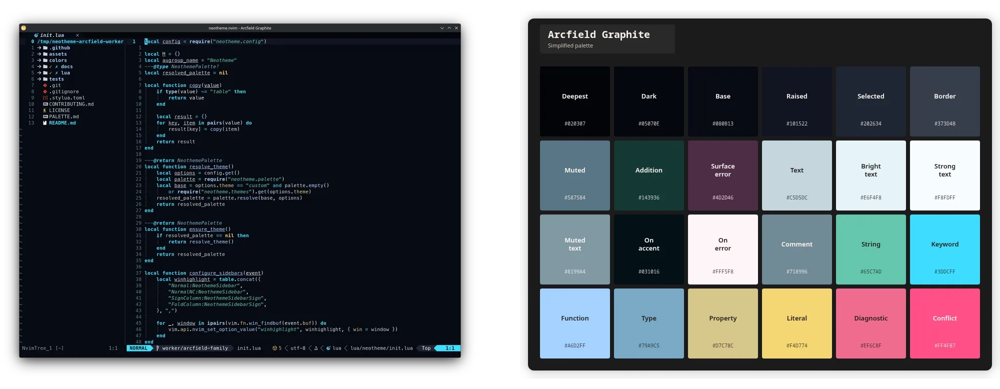

# Arcfield theme family

Arcfield is a storm-field family built around graphite-blue structure and lightning discharge. Electric cyan controls the visual field, blue-white or cobalt callables carry the strike through navigation and links, and cool teal success, yellow-bearing members, and focused literal cores separate secondary roles.

## Themes

| Theme | Character | Background |
| --- | --- | --- |
| `arcfield-graphite` | Graphite storm fields with controlled blue-white discharge. | Dark |
| `arcfield-porcelain` | Cool insulator white with charged cyan and cobalt roles. | Light |
| `arcfield-surge` | High-energy storm contrast with brighter structural separation. | Dark |

## Previews

[Open the full-size Arcfield editor and palette matrix](./arcfield-matrix.webp).
