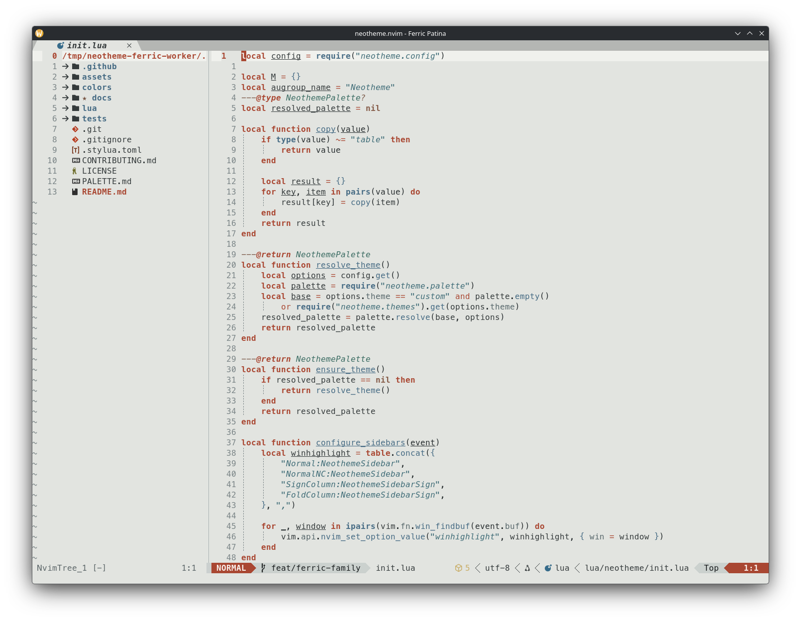
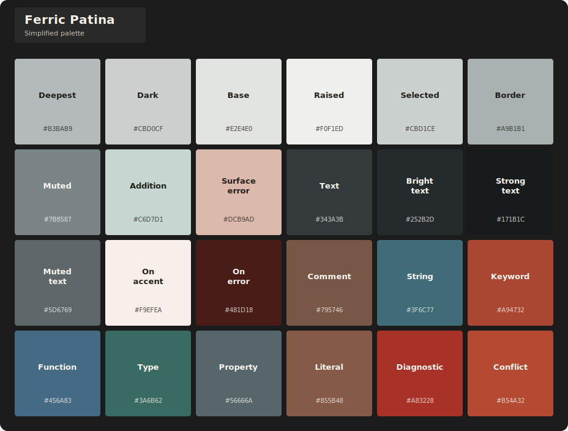

# Ferric theme family

Ferric pairs dark and light industrial themes shaped by iron, steel, rust, copper, and restrained verdigris. Forge uses charcoal and steel surfaces with pale metal text; Patina carries the same material relationships onto pale oxidized surfaces.

## Themes

| Theme | Character | Background |
| --- | --- | --- |
| `ferric-forge` | Charcoal iron with pale steel text and rust accents. | Dark |
| `ferric-patina` | Pale oxidized steel with dark iron text and shared rust accents. | Light |

## Previews

### Ferric Forge

**Editor preview**

**Simplified palette**

### Ferric Patina

**Editor preview**

**Simplified palette**

