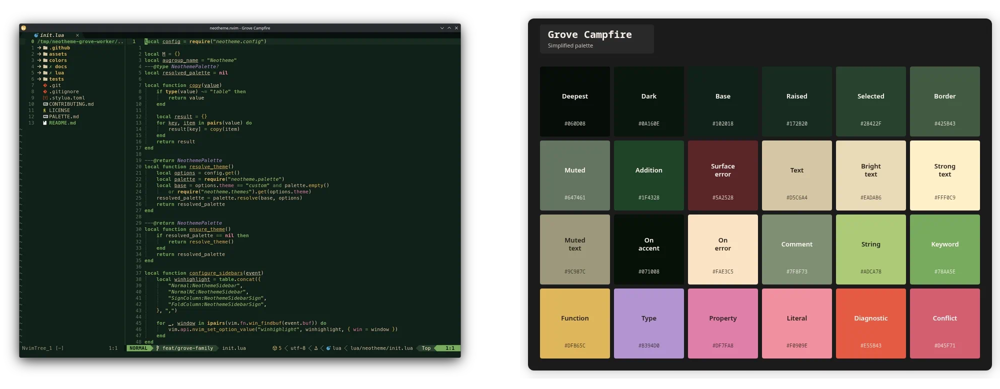

# Grove theme family

Grove is a botanical fantasy-adventure family that aims for a medieval woodland interface framed by parchment, aged metal, and heraldic depth. Campfire grows from dark leafy surfaces with parchment text; Parchment carries deliberate leaf-green structure across an aged manual or character sheet. Deep leaf green directs control flow and interface emphasis, lighter moss carries strings and positive states, and marigold aged gold guides navigation. Foxglove violet, mallow rose, and coral peony recur through the magical flower layer, while poppy ember remains a focused error signal. Oxblood shadows and dark ink keep those colors grounded.

## Themes

| Theme | Character | Background |
| --- | --- | --- |
| `grove-campfire` | Dark leafy camp and woodland surfaces with parchment text, marigold navigation, and violet, mallow, and coral-peony accents. | Dark |
| `grove-parchment` | Aged manual surfaces with dark ink, leaf-green structure, and curated marigold, foxglove, mallow, and peony accents. | Light |

## Previews

[Open the full-size Grove editor and palette matrix](./grove-matrix.webp).
