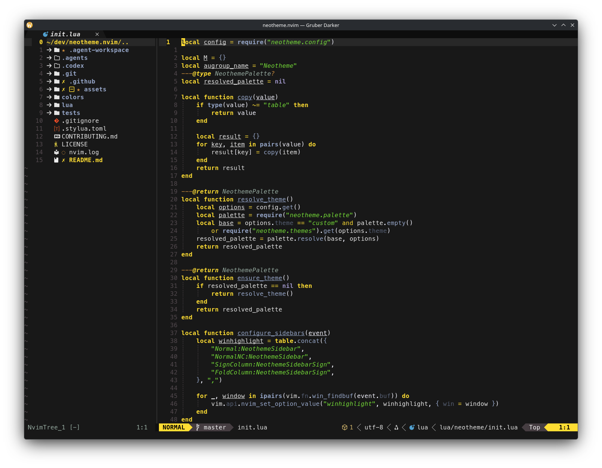
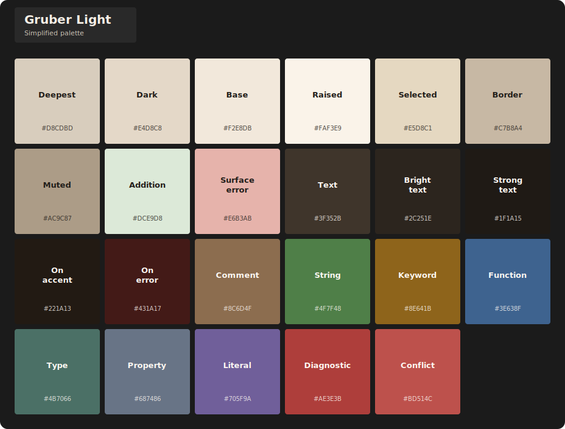
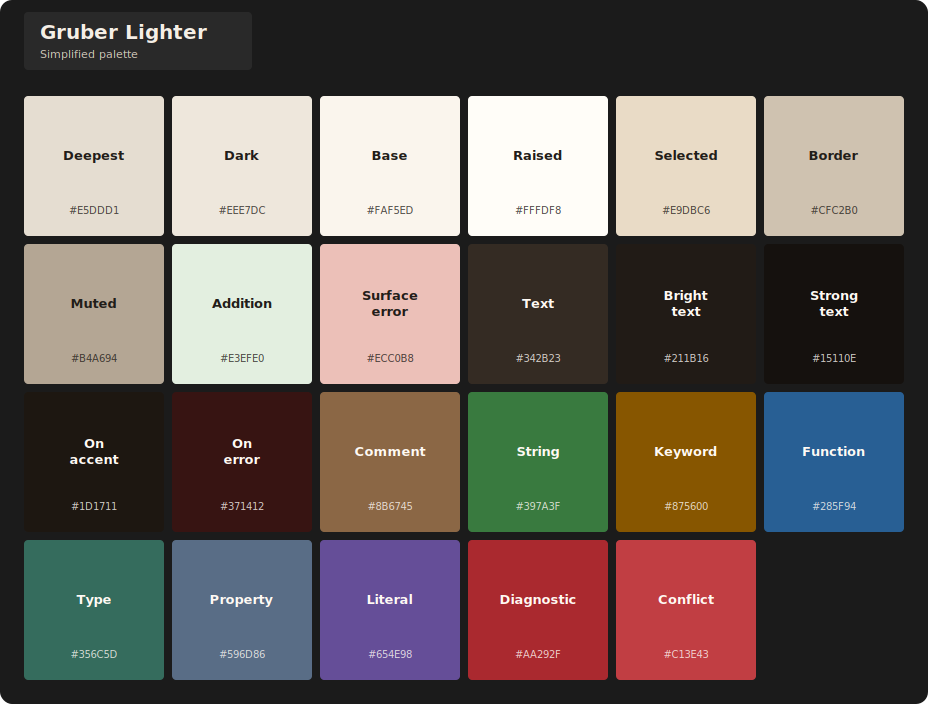

# Gruber theme family

Gruber is a warm family of six coordinated dark and light variants. A shared semantic structure varies in brightness, contrast, and chroma across muted, balanced, and high-clarity environments.

## Themes

| Theme | Character | Background |
| --- | --- | --- |
| `gruber-dark-muted` | Restrained and warm. The Neotheme default. | Dark |
| `gruber-dark` | Balanced with clear contrast. | Dark |
| `gruber-darker` | Deep and high contrast. | Dark |
| `gruber-light` | Warm and paper-like. | Light |
| `gruber-lighter` | Bright and crisp. | Light |
| `gruber-light-muted` | Soft and lower chroma. | Light |

## Previews

### Gruber Dark Muted

**Editor preview**

**Simplified palette**

### Gruber Dark

**Editor preview**

**Simplified palette**

### Gruber Darker

**Editor preview**

**Simplified palette**

### Gruber Light

**Editor preview**

**Simplified palette**

### Gruber Lighter

**Editor preview**

**Simplified palette**

### Gruber Light Muted

**Editor preview**

**Simplified palette**

## Lineage

The Gruber family builds on [blazkowolf/gruber-darker.nvim](https://github.com/blazkowolf/gruber-darker.nvim) and the work that established its Neovim foundation.

Its palette lineage also includes [rexim/gruber-darker-theme](https://github.com/rexim/gruber-darker-theme), [drsooch/gruber-darker-vim](https://github.com/drsooch/gruber-darker-vim), [Jim Blevins' Emacs port](https://jblevins.org/projects/emacs-color-themes/gruber-darker-theme.el.html), and John Gruber's original [BBEdit Gruber Dark scheme](https://daringfireball.net/projects/bbcolors/schemes/).
