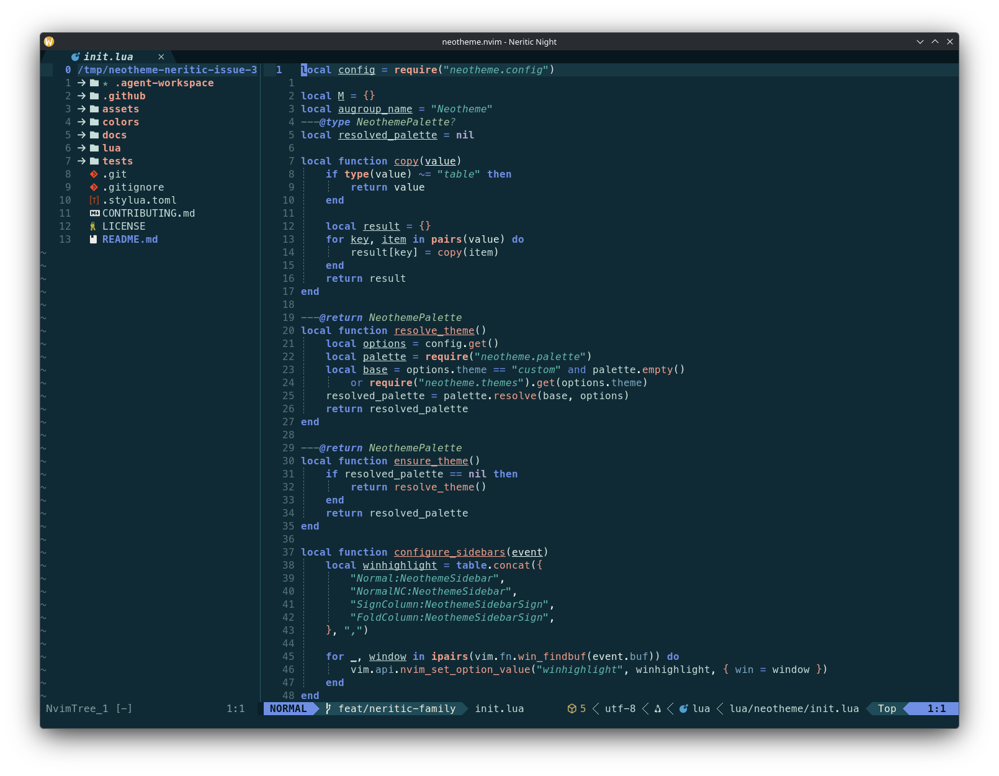
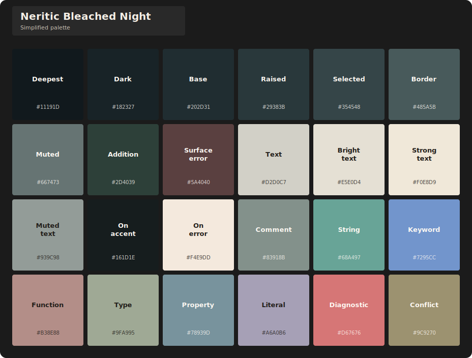
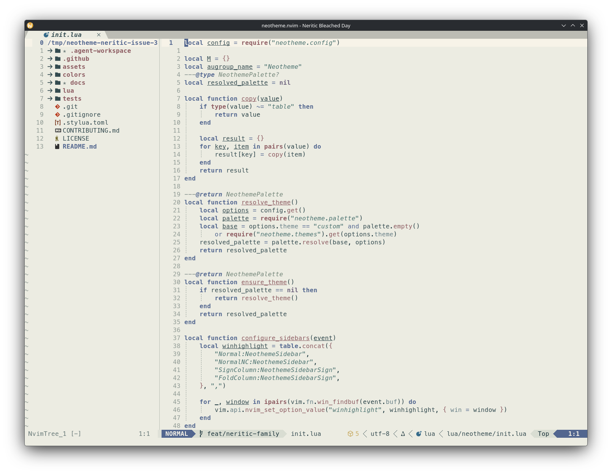

# Neritic theme family

Neritic brings a shallow-ocean and coral-reef identity to two vivid coastal themes and two lower-chroma bleached variants. Navy, turquoise, sea glass, algae, coral, sand, and moonlit blue move between dark and light surfaces within one semantic structure.

## Themes

| Theme | Character | Background |
| --- | --- | --- |
| `neritic-night` | Moonlit navy and teal with luminous coastal accents. | Dark |
| `neritic-day` | Clear turquoise, ocean blue, fog, and sunlit coral. | Light |
| `neritic-bleached-night` | Dark coastal surfaces with faded algae and bone-coral neutrals. | Dark |
| `neritic-bleached-day` | Chalky coral surfaces with deep-water text and subdued sea glass. | Light |

## Previews

### Neritic Night

**Editor preview**

**Simplified palette**

### Neritic Day

**Editor preview**

**Simplified palette**

### Neritic Bleached Night

**Editor preview**

**Simplified palette**

### Neritic Bleached Day

**Editor preview**

**Simplified palette**

