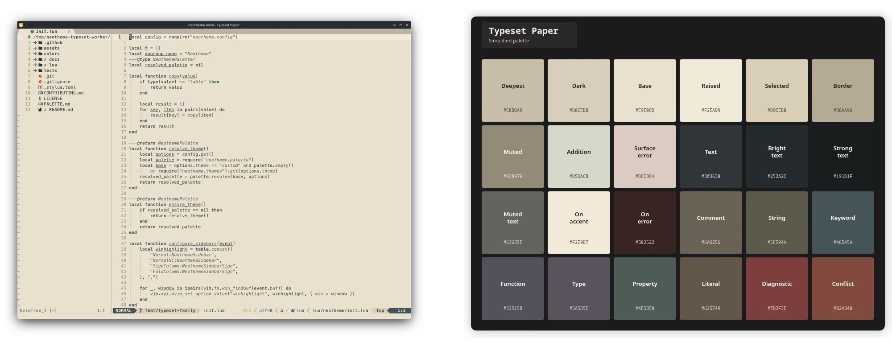

# Typeset theme family

Typeset treats code as one blue-black ink ageing across a printed page. Dense ink, oxidized violet-grey, dried sepia edges, and muted teal or olive residue separate ordinary roles, while proofing red marks focused signals. Paper uses newsprint surfaces with dark ink; Ink reverses the material relationship with warm paper text on a dark press-ink field.

## Themes

| Theme | Character | Background |
| --- | --- | --- |
| `typeset-paper` | Warm newsprint with an ageing blue-black ink hierarchy. | Light |
| `typeset-ink` | Blue-black press ink with a restrained warm-paper hierarchy. | Dark |

## Previews

[Open the full-size Typeset editor and palette matrix](./typeset-matrix.webp).
