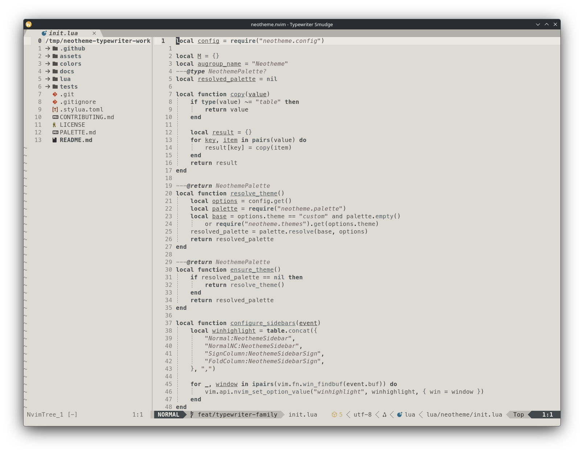
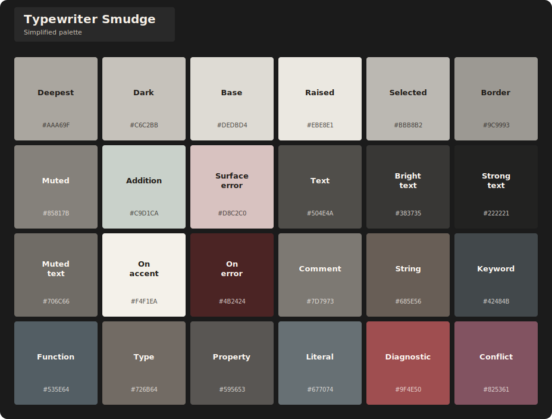
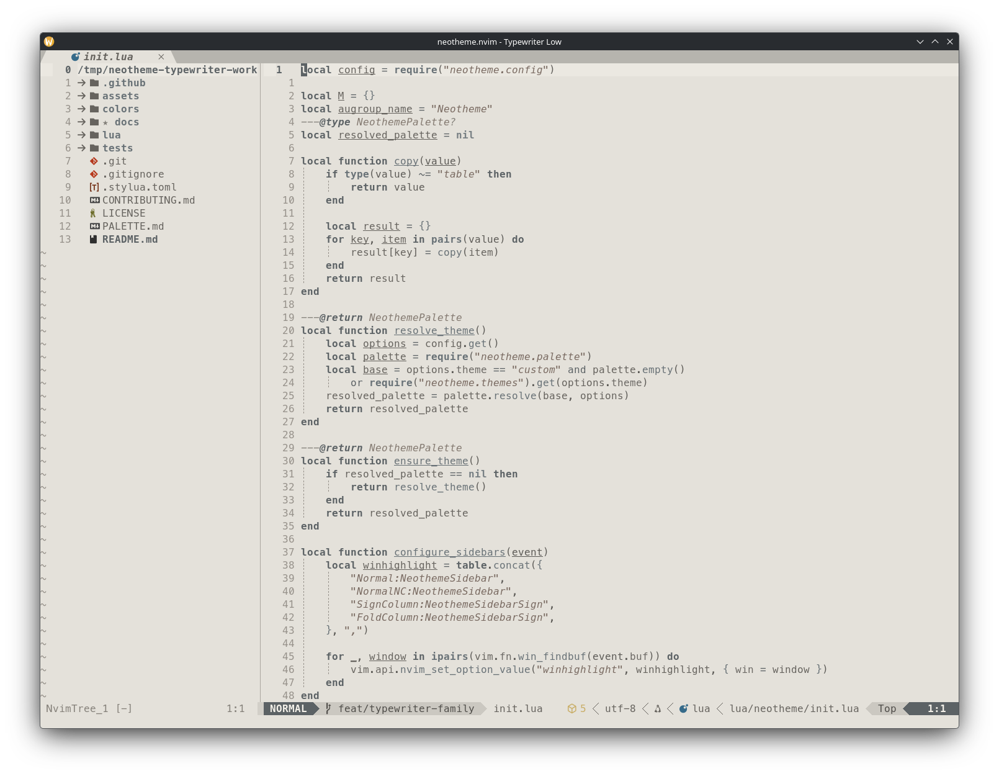
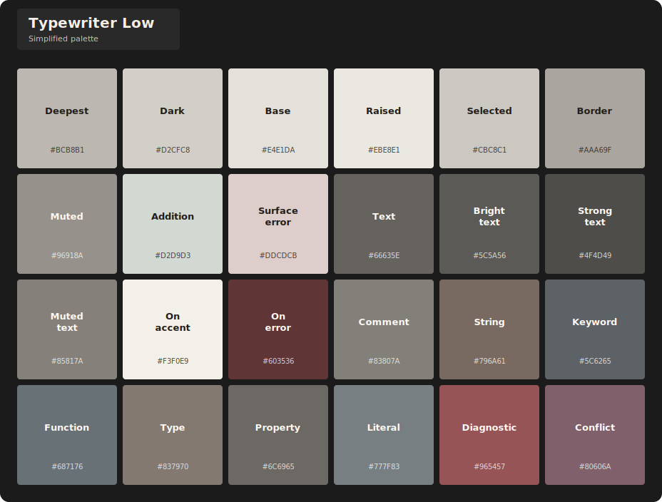
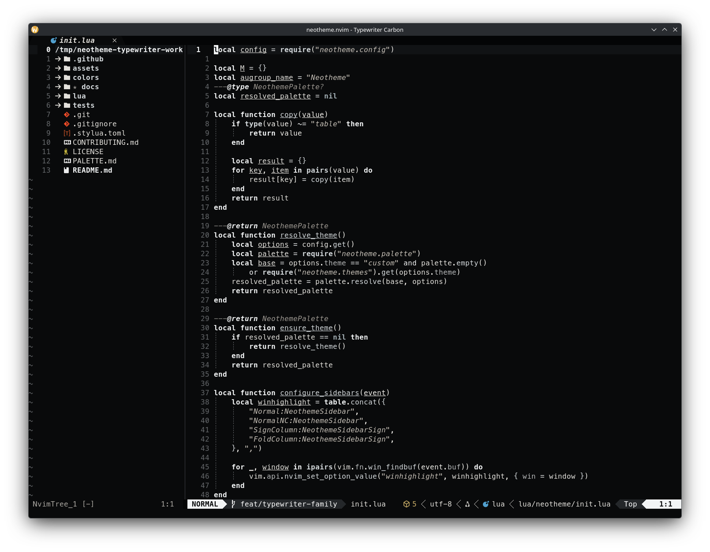
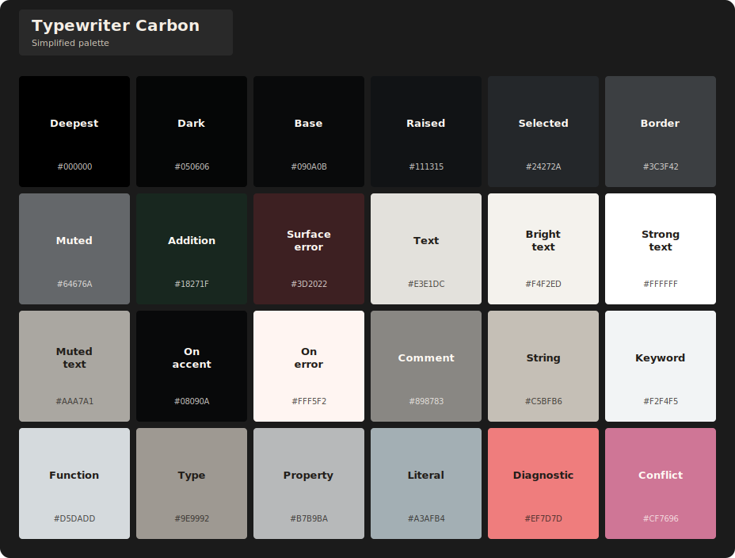
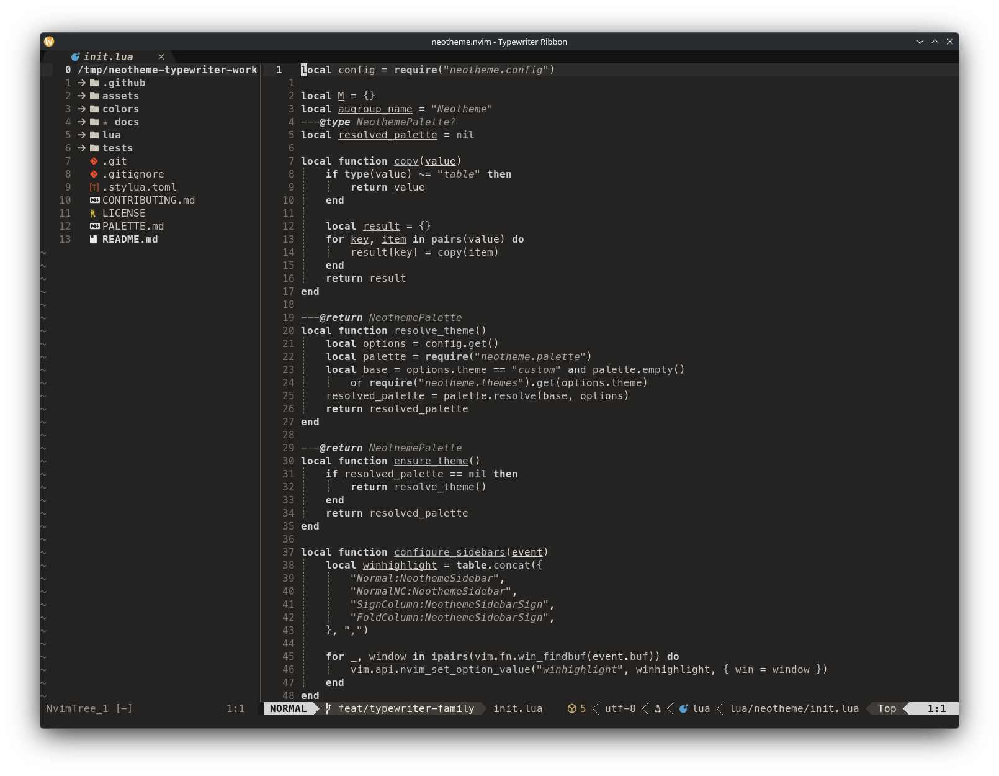
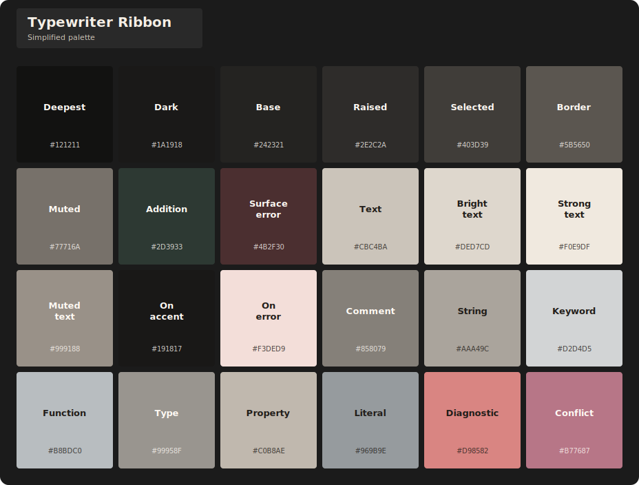

# Typewriter theme family

Typewriter evokes paper, ink, carbon, smudges, and worn ribbon through predominantly grayscale palettes. Luminance and subtle neutral-temperature shifts shape readable syntax and editor structure, while restrained diagnostic and version-control color provides focused signals.

## Variants

| Theme | Character | Background |
| --- | --- | --- |
| `typewriter-smudge` | Layered paper, smudged impressions, and worn-key surfaces at medium contrast. | Light |
| `typewriter-ink` | Crisp paper and near-black ink at the family's highest light contrast. | Light |
| `typewriter-low` | Deliberately faded, low-ink impressions with a readable text hierarchy. | Light |
| `typewriter-carbon` | Carbon-black surfaces and crisp paper-white text at high contrast. | Dark |
| `typewriter-ribbon` | Soft worn charcoal with warm gray text and gentler separation. | Dark |

## Previews

<table>
<tr>
<td align="center" valign="top">
<strong>Typewriter Smudge</strong>  

</td>
<td align="center" valign="top">
<strong>Typewriter Ink</strong>  

</td>
<td align="center" valign="top">
<strong>Typewriter Low</strong>  

</td>
<td align="center" valign="top">
<strong>Typewriter Carbon</strong>  

</td>
<td align="center" valign="top">
<strong>Typewriter Ribbon</strong>  

</td>
</tr>
</table>