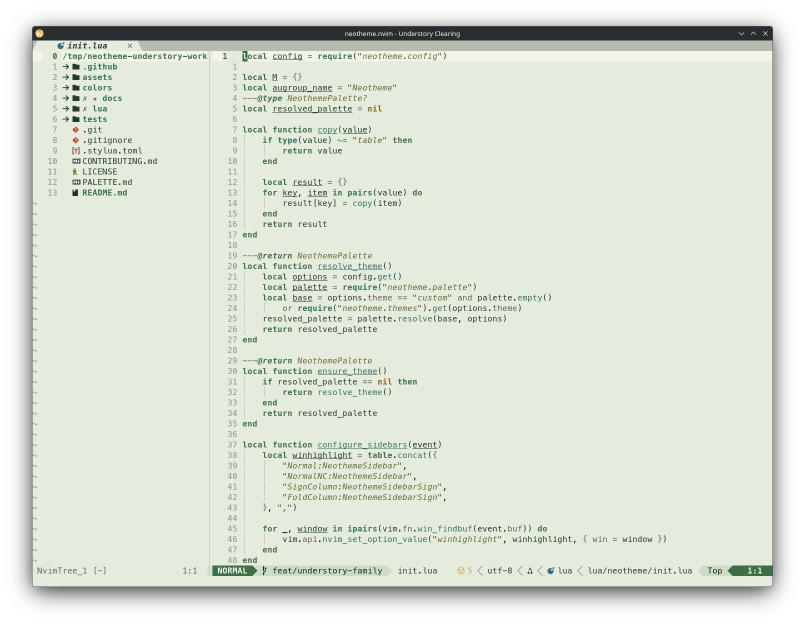
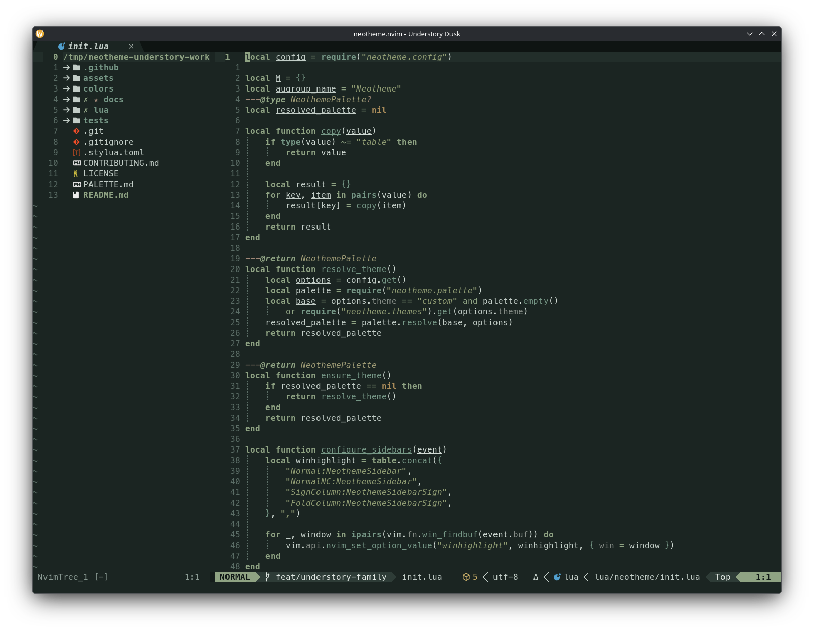

# Understory theme family

Understory is a naturalistic forest family designed for long editing sessions. Canopy shadow, open clearing light, woodland dusk, and soft mist shape distinct environments from pine, fern, moss, lichen, bark, and fogged leaf tones.

## Themes

| Theme | Character | Background |
| --- | --- | --- |
| `understory-canopy` | Canopy-filtered forest shadow with cool, clear structure. | Dark |
| `understory-clearing` | Diffuse daylight over pale leaf-green surfaces. | Light |
| `understory-dusk` | Woodland twilight with muted, lower-chroma roles. | Dark |
| `understory-mist` | Fog-softened light with quiet but distinct roles. | Light |

## Previews

<table>
<tr>
<td align="center" valign="top">
<strong>Understory Canopy</strong>  

</td>
<td align="center" valign="top">
<strong>Understory Clearing</strong>  

</td>
<td align="center" valign="top">
<strong>Understory Dusk</strong>  

</td>
<td align="center" valign="top">
<strong>Understory Mist</strong>  

</td>
</tr>
</table>