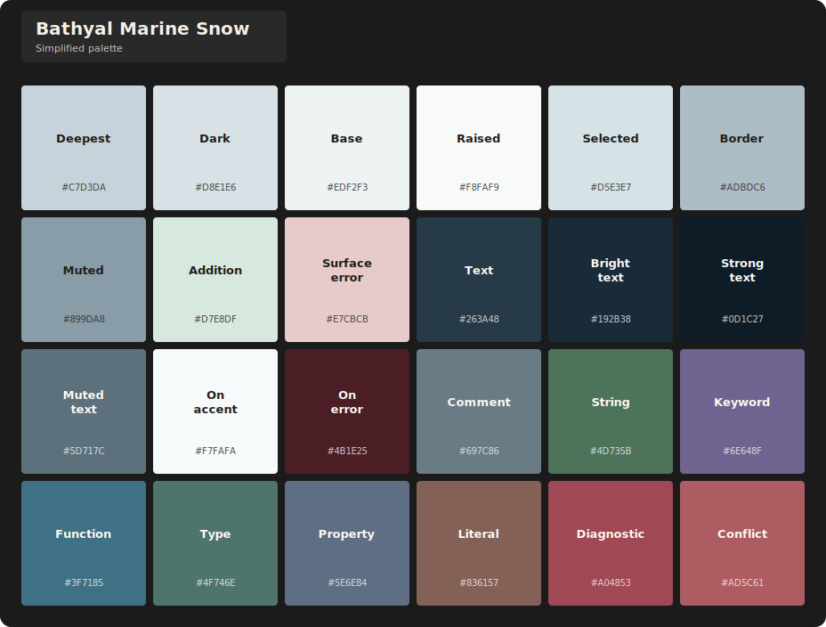
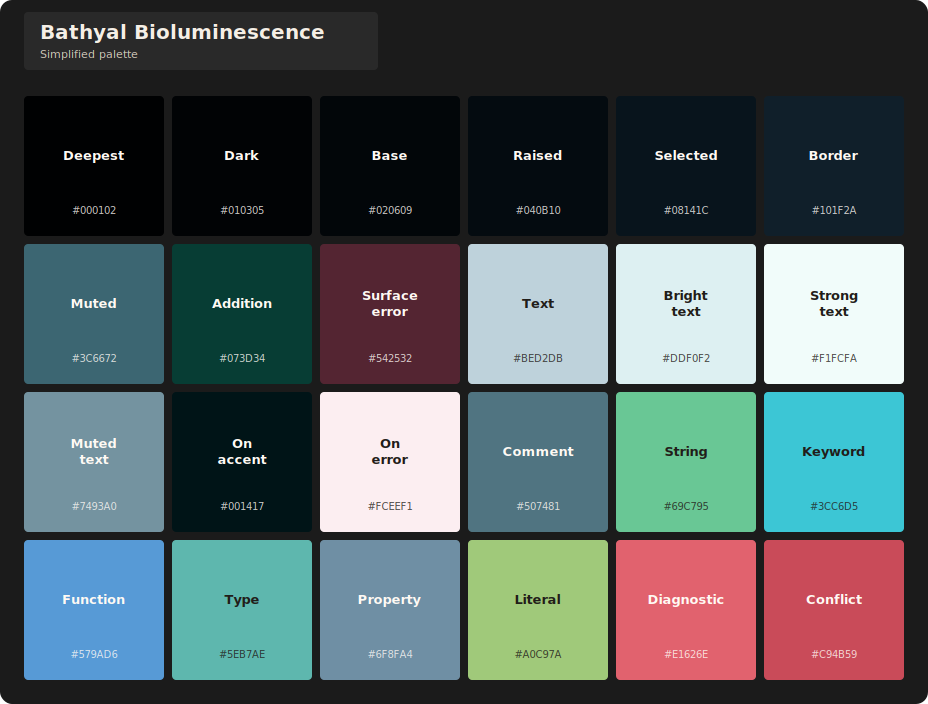

# Bathyal theme family

Bathyal evokes the permanently dark, cold, high-pressure deep ocean. Near-black pressure-blue variants keep luminous accents selective, while Marine Snow translates the submerged character into pale blue-gray and off-white.

## Themes

| Theme | Character | Background |
| --- | --- | --- |
| `bathyal-midwater` | Near-black, cold, and restrained with sparse cyan, violet, green, and muted-red accents. | Dark |
| `bathyal-marine-snow` | Pale and particulate with subdued organic and mineral colors. | Light |
| `bathyal-bioluminescence` | Focused blue, cyan, and green signals with strong semantic separation. | Dark |

## Previews

### Bathyal Midwater

**Editor preview**

**Simplified palette**

### Bathyal Marine Snow

**Editor preview**

**Simplified palette**

### Bathyal Bioluminescence

**Editor preview**

**Simplified palette**

