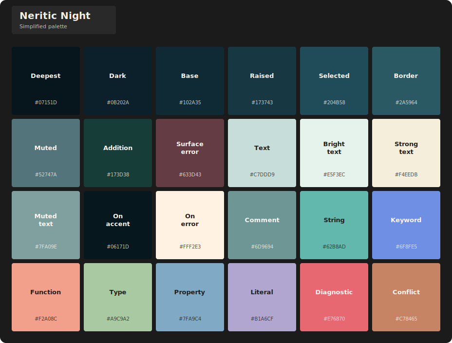
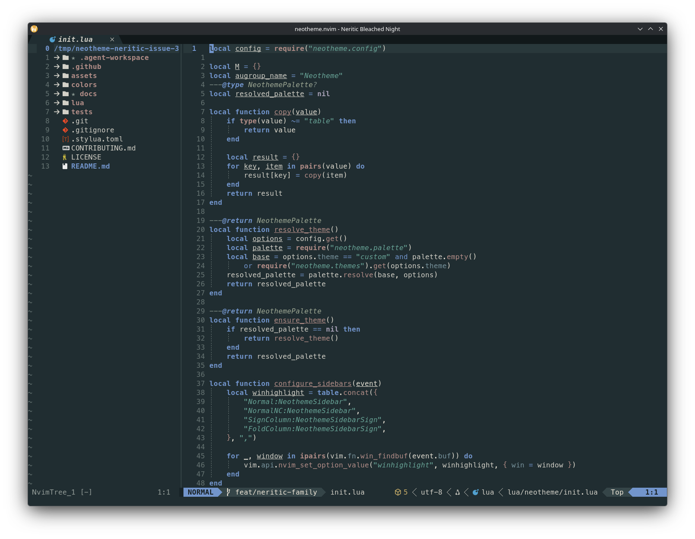
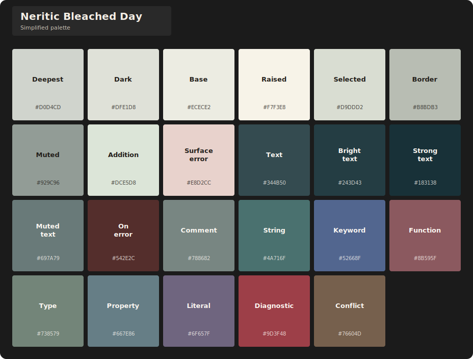

# Neritic theme family

[<- neotheme.nvim](../../../../README.md)

The Neritic family brings a cool shallow-ocean identity to two vivid coastal themes and two independently tuned, lower-chroma bleached variants. Navy, turquoise, sea glass, algae, coral, sand, and moonlit blue move between dark and light surfaces without changing the shared semantic structure.

## Themes

| Theme | Character | Background |
| --- | --- | --- |
| `neritic-night` | Moonlit navy and teal with luminous coastal accents. | Dark |
| `neritic-day` | Clear turquoise, ocean blue, fog, and sunlit coral. | Light |
| `neritic-bleached-night` | Dark coastal surfaces with faded algae and bone-coral neutrals. | Dark |
| `neritic-bleached-day` | Chalky coral surfaces with deep-water text and subdued sea glass. | Light |

Select any variant during setup and keep the shared colorscheme entrypoint:

```lua
require("neotheme").setup({
	theme = "neritic-day",
})

vim.cmd.colorscheme("neotheme")
```

## Visual inventory

Every editor preview uses the same integrated Neovim configuration. Each palette card shows the compact colors configured by that theme exactly once. Expanded semantic aliases are intentionally omitted.

### Neritic Night

**Editor preview**


**Simplified palette**



### Neritic Day

**Editor preview**


**Simplified palette**


### Neritic Bleached Night

**Editor preview**



**Simplified palette**


### Neritic Bleached Day

**Editor preview**


**Simplified palette**



The previews and palette cards can be reproduced with the repository's [asset scripts](../../../../assets/scripts/README.md).
