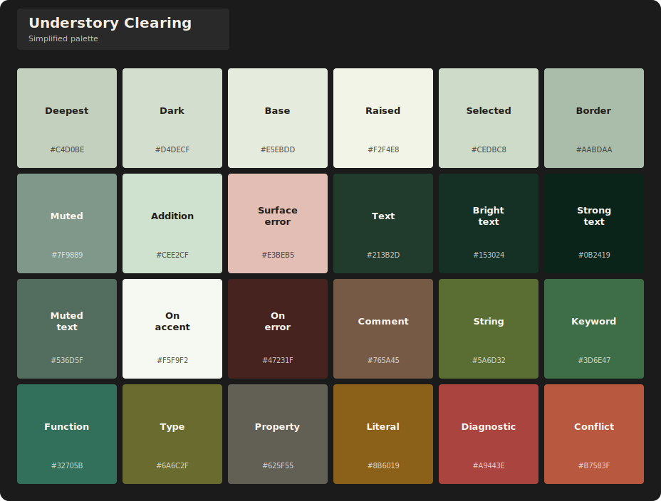
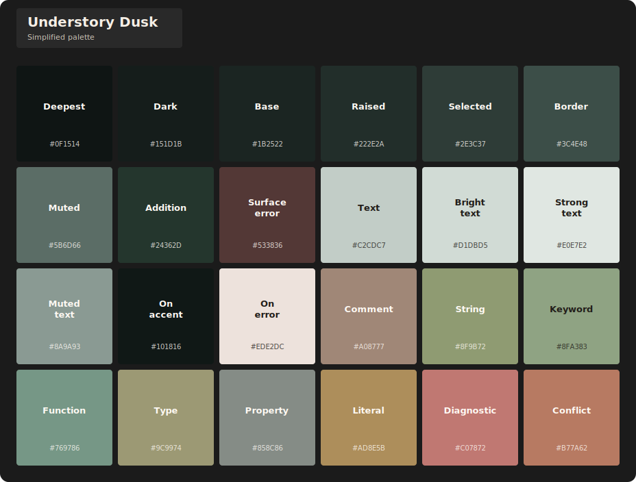
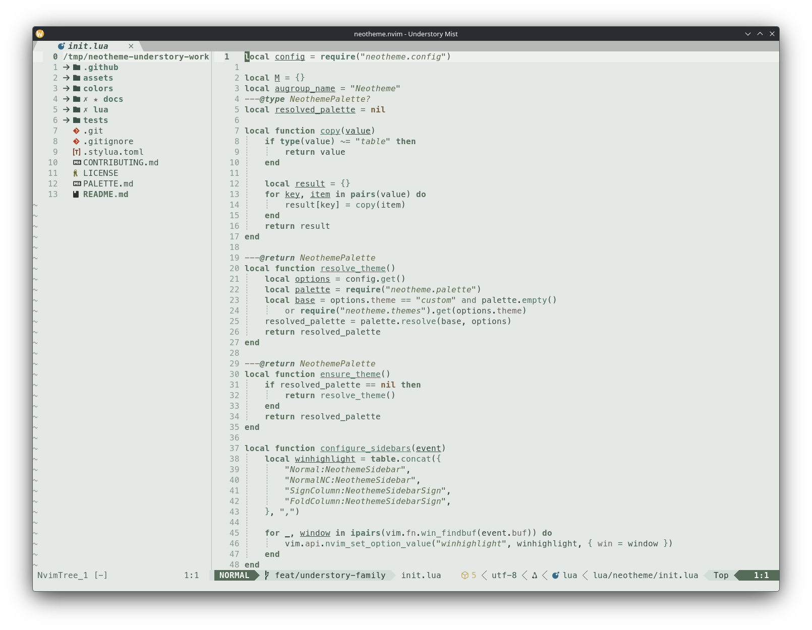
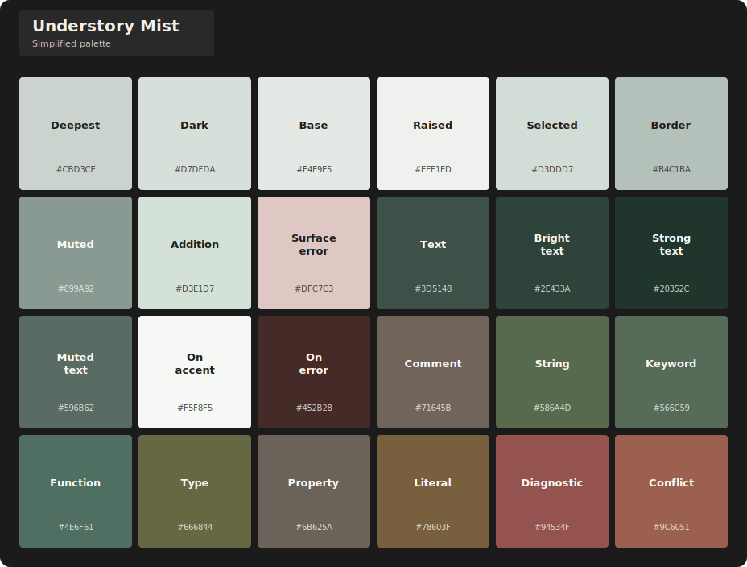

# Understory theme family

[<- neotheme.nvim](../../../../README.md)

The Understory family gives Neotheme four nature-led dark and light variants for long editing sessions. Canopy shadow, open clearing light, blue-green dusk, and soft mist shape distinct environments around a shared cool forest identity.

## Themes

| Theme | Character | Background |
| --- | --- | --- |
| `understory-canopy` | Canopy-filtered forest shadow with cool, clear structure. | Dark |
| `understory-clearing` | Diffuse daylight over pale leaf-green surfaces. | Light |
| `understory-dusk` | Blue-green twilight with muted, lower-chroma roles. | Dark |
| `understory-mist` | Fog-softened light with quiet but distinct roles. | Light |

Select any variant during setup and keep the shared colorscheme entrypoint:

```lua
require("neotheme").setup({
	theme = "understory-canopy",
})

vim.cmd.colorscheme("neotheme")
```

## Visual inventory

Every editor preview uses the same integrated Neovim configuration. Each palette card shows the compact colors configured by that theme exactly once. Expanded semantic aliases are intentionally omitted.

### Understory Canopy

**Editor preview**


**Simplified palette**


### Understory Clearing

**Editor preview**


**Simplified palette**



### Understory Dusk

**Editor preview**


**Simplified palette**



### Understory Mist

**Editor preview**



**Simplified palette**



The previews and palette cards can be reproduced with the repository's [asset scripts](../../../../assets/scripts/README.md).
